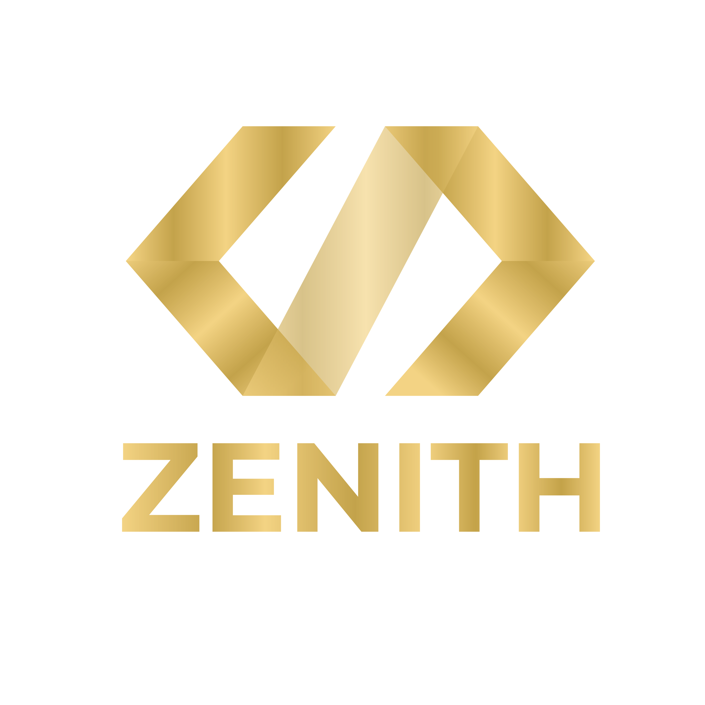

# Zenith

<div align="center">
  

**Agence de développement web et design sur mesure**

[](https://nuxt.com/)
[](https://www.typescriptlang.org/)
[](https://tailwindcss.com/)
[](https://vuejs.org/)

</div>

---

## À propos de Zenith

**Zenith** est une agence de développement web et design spécialisée dans la création de sites web sur mesure. Nous combinons expertise technique et vision créative pour transformer vos idées en expériences digitales exceptionnelles.

### Notre positionnement

- **Luxe** : Design raffiné et attention aux détails
- **Professionnalisme** : Standards de qualité élevés
- **Accessibilité** : Solutions optimisées pour tous les utilisateurs

---

## Table des matières

- [Technologies](#technologies)
- [Architecture](#architecture)
- [Commandes de développement](#commandes-de-développement)
- [Standards de code](#standards-de-code)
- [Accessibilité & Internationalisation](#accessibilité--internationalisation)
- [Identité de marque](#identité-de-marque)
- [Contact](#contact)

---

## Technologies

### Stack technique

- **Framework** : Nuxt.js 3 (v3.15.4) avec Vue.js 3
- **Langage** : TypeScript
- **Styling** : Tailwind CSS avec classes utilitaires personnalisées
- **Composants UI** : shadcn-nuxt + Radix Vue (primitives accessibles)
- **Internationalisation** : @nuxtjs/i18n (Français/Anglais)
- **Gestion de contenu** : @nuxt/content pour pages markdown
- **Thème** : @nuxtjs/color-mode pour mode sombre/clair
- **Validation de formulaires** : Vee-validate + Zod schemas
- **Service email** : EmailJS pour formulaire de contact
- **Anti-spam** : Vue Recaptcha v3
- **Runtime** : Bun (package manager et runtime)

### Bibliothèques principales

```json
{
  "nuxt": "^3.15.4",
  "vue": "^3.5.13",
  "@nuxtjs/i18n": "^9.2.0",
  "@nuxtjs/tailwindcss": "^6.12.3",
  "shadcn-nuxt": "^0.10.4",
  "vee-validate": "^4.15.1",
  "zod": "^3.25.1"
}
```

---

## Architecture

### Structure des répertoires

```
Zenith/
├── app/
│   ├── components/
│   │   ├── common/          # Composants réutilisables
│   │   ├── footer/          # Composants footer
│   │   ├── icons/           # Icônes personnalisées
│   │   ├── projects/        # Composants projets
│   │   └── ui/              # Composants shadcn UI
│   ├── pages/
│   │   ├── index.vue        # Page d'accueil
│   │   ├── contact/         # Page contact
│   │   ├── en/              # Pages anglaises
│   │   └── fr/              # Pages françaises
│   ├── constants/           # Données statiques
│   ├── types/               # Définitions TypeScript
│   ├── i18n/locales/        # Fichiers de traduction
│   ├── composables/         # Composables Vue
│   └── layouts/             # Layouts Nuxt
├── public/
│   └── images/brand/        # Logos et assets de marque
├── tailwind.config.js       # Configuration Tailwind
└── nuxt.config.ts           # Configuration Nuxt
```

### Composants principaux

- **Layout** : `layouts/default.vue` - Layout principal
- **Navigation** : `components/Navbar.vue` - Barre de navigation
- **Header** : `components/Header.vue` - En-tête page d'accueil
- **Footer** : `components/Footer.vue` - Pied de page
- **Formulaire de contact** : `components/ContactForm.vue` - Formulaire avec validation
- **Projets** : `components/Projects.vue` - Liste des projets
- **Sélecteur de langue** : `components/LangChoice.vue` - Changement de langue

---

## Commandes de développement

```bash
# Démarrer le serveur de développement (http://localhost:3000)
bun dev

# Démarrer le serveur avec accès réseau
bun dev:http

# Build pour production
bun build

# Générer le site statique
bun generate

# Prévisualiser le build de production
bun preview
```

---

## Standards de code

### Règles TypeScript strictes

Ce projet suit des **standards TypeScript stricts** :

- **Tout doit être typé explicitement** (variables, fonctions, props, refs)
- **Aucun type implicite** autorisé
- **Types complexes** → créer des fichiers dédiés dans `types/`

#### Exemples

```typescript
// ✅ BON - Types explicites
const name = ref<string>('')
const count = ref<number>(0)

function calculateTotal(price: number, quantity: number): number {
  return price * quantity
}

interface ProjectCardProps {
  title: string
  description: string
  technologies: string[]
}

// ❌ MAUVAIS - Types implicites
const name = ref('')
function calculateTotal(price, quantity) {
  return price * quantity
}
```

### Principes de code propre

- **Nommage descriptif** : Noms clairs et auto-documentés
- **Responsabilité unique** : Une fonction = un objectif
- **Pas de valeurs magiques** : Utiliser des constantes nommées
- **Principe DRY** : Ne vous répétez pas
- **Gestion d'erreurs** : Try/catch explicites
- **Formatage cohérent** : Suivre les patterns existants

---

## Accessibilité & Internationalisation

### Accessibilité (a11y)

Ce projet suit **WCAG 2.1 Niveau AA** :

- **HTML sémantique** : Hiérarchie de titres, éléments appropriés
- **Labels ARIA** : Tous les éléments interactifs ont des labels
- **Navigation clavier** : Tous les éléments sont accessibles au clavier
- **Contraste des couleurs** : Minimum 4.5:1 pour texte normal
- **Support lecteurs d'écran** : Testé avec NVDA/JAWS/VoiceOver

### Internationalisation (i18n)

- **Langues supportées** : Français (par défaut), Anglais
- **Tout le texte visible** doit utiliser `$t('key')`
- **Fichiers de traduction** : `i18n/locales/fr.json` et `en.json`

```vue
<!-- ✅ BON -->
<h1>{{ $t('home.title') }}</h1>
<button :aria-label="$t('actions.close')">{{ $t('actions.close') }}</button>

<!-- ❌ MAUVAIS -->
<h1>Bienvenue chez Zenith</h1>
```

---

## Identité de marque

### Palette de couleurs

Thème Or/Bronze luxueux :

```css
/* Couleurs principales */
--zenith-bronze-dark: #7b542f /* Bronze foncé */ --zenith-gold-bronze: #b6771d
  /* Or-bronze principal */ --zenith-gold-vivid: #ff9d00 /* Or vif (CTAs) */
  --zenith-champagne: #ffcf71 /* Champagne clair */ /* Couleurs neutres */ --zenith-bg-dark: #0a0a0a
  /* Fond mode sombre */ --zenith-bg-light: #fafaf9 /* Fond mode clair */;
```

### Typographie

- **Police principale** : Montserrat
  - Titres : Montserrat Bold/SemiBold (600-700)
  - Corps : Montserrat Regular/Medium (400-500)
  - CTAs : Montserrat SemiBold (600)

### Style visuel

- Design moderne et professionnel
- Animations subtiles et fluides
- Espacement généreux
- Contraste élevé pour lisibilité
- Effets de lueur dorée sur éléments interactifs
- Support mode sombre/clair

---

## Contact

Vous avez un projet en tête ? Contactez-nous !

- **Site web** : [dg-zenith.com](https://dg-zenith.com)
- **Email** : contact@dg-zenith.com
- **Localisation** : Thionville, France

---

## Licence

Ce projet est la propriété de **Zenith**. Tous droits réservés.

---

<div align="center">
  <p>Développé avec passion par <a href="https://github.com/MehdiDiasGomes">Mehdi DIAS GOMES</a> - Développeur web freelance</p>
  <p>© 2026 Zenith - Agence de développement web et design</p>
</div>
